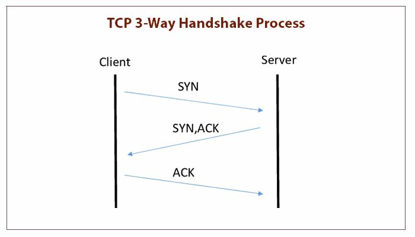

# [TIL] TCP UDP

##  😃 잡담
요 내용도 서버 스터디를 준비하며 더 자세히 알게된 내용이다. 사실 TCP, UDP에 대해서는 알고는 있었다. 정말 알고만 있었기에 스터디를 준비하며 이번에는 진짜 이해를 해보자라는 목표를 가지고 TIL 주제를 TCP, UDP로 선정하고 나름대로 설명을 써봤다.

## 📄 배운 내용
### TCP란?

## TCP **(Transmission Control Protocol)**

> 신뢰성 있는 연결 기반의 프로토콜로, 스트림 형태의 데이터 통신을 지원
> 

- **신뢰성 있는 연결 기반 프로토콜:**  **… ex) 3-way handshake, 4-way handshake**
    
    TCP는 연결을 설정하고 데이터를 전송하기 전에 신뢰성 있는 연결을 확립. 이 연결은 데이터의 정확한 전달을 보장하며, 데이터의 순서를 유지함.
    
- **스트림 형태의 데이터 통신:**
    
    TCP는 데이터를 스트림으로 처리하며, 데이터의 일부분이 분할되거나 조각화되지 않고 전달됨. 이로써 연속적인 데이터 스트림을 보내고 받을 수 있음.
    
- **손실 및 재전송:**
    
    TCP는 데이터 전송 중 손실된 패킷을 감지하고, 손실된 패킷을 다시 요청하여 신뢰성을 유지함. 따라서 데이터 손실을 최소화하고 안정적인 통신을 지원.
    

**사용 예시:**

- **웹 브라우징:**
    
    웹 페이지를 불러올 때 사용자가 정확한 데이터를 볼 수 있도록 신뢰성 있는 연결이 필요.
    
    *웹 브라우저는 HTTP 프로토콜 위에서 TCP를 사용하여 웹 서버와 통신*
    
- **이메일 전송**
    
    이메일을 전송할 때 이메일 내용의 손실이나 변형을 피하기 위해 TCP를 사용.
    
    S*MTP (Simple Mail Transfer Protocol) 등의 프로토콜은 TCP를 기반으로 동작*
    

## 3-way handshake

> 클라이언트와 서버 간의 신뢰성 있는 연결을 확립하기 위해 사용
> 

- TCP의 연결 설정 과정 중 하나
    
    클라이언트와 서버 간의 초기 연결 설정을 안전하게 수행하기 위한 중요한 절차
    

**과정**

1. **클라이언트가 서버에게 연결 요청 (SYN):**
    - 클라이언트가 서버에 연결을 요청하기 위해 SYN(Synchronize) 패킷을 보냄. 이 패킷은 클라이언트가 서버와 통신을 시작하고자 함을 나타냅.
    - 클라이언트는 임의의 초기 순차 번호(ISN - Initial Sequence Number)를 선택하고 이를 SYN 패킷에 포함시킴.
    
    ***listen 상태인 서버의 소켓에 연결 요청을 보내는 것***
    
2. **서버가 연결 요청 수락 및 응답 (SYN-ACK):**
    - 서버는 클라이언트의 SYN 패킷을 받으면 연결 요청을 수락하고, 클라이언트와 서버 간의 통신을 위한 자신의 초기 순차 번호를 선택함.
    - 서버는 클라이언트의 ISN에 1을 더한 값을 자신의 ISN으로 사용하고, SYN-ACK 패킷을 클라이언트에게 보냄. 이 패킷은 클라이언트가 서버의 연결 요청을 수락함을 의미.
    
    ***accept 시스템 콜 이후 진행***
    
3. **클라이언트가 서버의 응답 확인 (ACK):**
    - 클라이언트는 서버로부터 받은 SYN-ACK 패킷을 받으면 이에 대한 확인 응답(ACK - Acknowledgment) 패킷을 서버에게 보냄. 이 패킷은 서버로부터의 응답을 확인하고 연결이 확립되었음을 알림.
    - 이제 클라이언트와 서버 간의 신뢰성 있는 연결이 확립되었으며, 양쪽에서 데이터를 안전하게 주고받을 수 있음.
    
    ***확인하면 Established 상태를 수입하고 본격적인 데이터의 송/수신이 이루어짐***
    

 

### UDP란?

## UDP **(User Datagram Protocol)**

> 비연결형 프로토콜로, 데이터를 데이터그램 형태로 주고 받음
> 

UDP 전용 소켓 = datagram 소켓

- **비연결형 프로토콜:**
    
    UDP는 연결을 설정하지 않고 데이터를 전송. 이로 인해 연결 설정 및 해제에 필요한 오버헤드가 없어 빠른 데이터 전송이 가능.
    
- **데이터그램 형태의 데이터 통신**
    
    UDP는 데이터를 데이터그램 형태로 전송. 이는 데이터를 여러 개의 패킷으로 나누어 보내는 것을 의미하며, 패킷 간의 연결이나 순서를 유지하지 않음
    
- **신속한 데이터 전송:**
    
    UDP는 손실된 데이터의 재전송을 하지 않으므로 TCP보다 빠른 데이터 전송이 가능합니다. 그러나 이로 인해 데이터 손실이나 순서 변경이 발생할 수 있음
    

**사용 예시:**

- **스트리밍 미디어:** 실시간 오디오 및 비디오 스트리밍 애플리케이션에서 UDP를 사용하여 빠르게 데이터를 전송
- **DNS (Domain Name System):** DNS 쿼리는 빠른 응답이 중요하며, 이를 위해 UDP를 사용

## ✨ 앞으로의 계획
서버 스터디 열심히 참여하기!